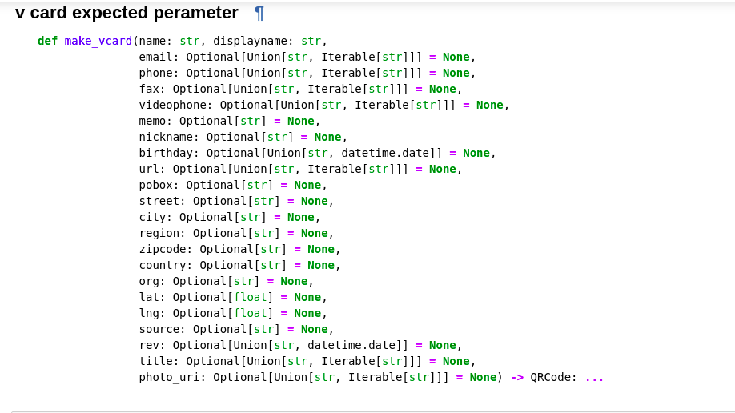

# -v_card_generator-
Qr code/V-card(multiple information) generator using segno
 
Docs link - <a href="https://segno.readthedocs.io/en/stable/index.html">Segno</a>
 
Github link - <a href="https://github.com/heuer/segno">heuer-Segno</a> 
Comparison of Python QR Code libraries - [click](https://segno.readthedocs.io/en/stable/comparison-qrcode-libs.html) 
For Example - [click](https://github.com/siumhossain/-v_card_generator-/blob/master/vobject(v_card_generator).ipynb)
### Screenshot

